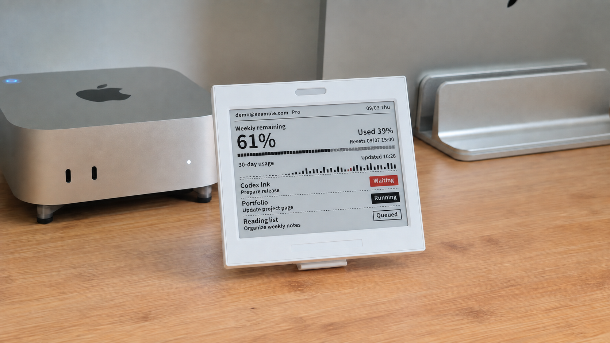
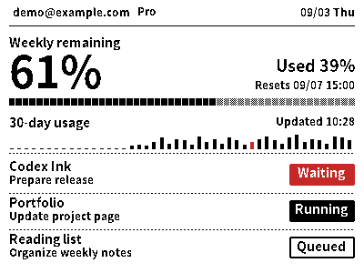
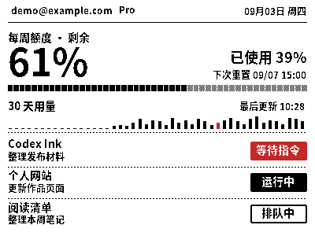

# Codex Ink

### E-Ink Usage & Task Monitor for macOS

Keep your Codex usage and task status on a small display beside your Mac. Codex Ink reads your existing Codex session data and sends a native 400 × 300 dashboard to a compatible Bluetooth e-paper display.

[简体中文](README.zh-CN.md) · [Build & setup](docs/installation.md) · [Privacy](docs/PRIVACY.md)

*AI-edited from a real desk photograph. The screen shows a composited English interface with fictional demo data; this is a presentation image, not physical-display verification. The interface supports Simplified Chinese and English.*

## Development preview

The current app version is **0.3.0**. Source builds and the local workflow have been tested on one Apple Silicon Mac. A standalone installer, Developer ID signing, notarization and a second-machine validation are still pending.

Project code is licensed under [GPL-3.0-only](LICENSE). Fonts and other third-party resources retain their own terms; see [third-party notices](THIRD_PARTY_NOTICES.md). This preview is built from source; no ready-to-install app download is provided.

## What it shows

- **Weekly Codex quota:** remaining and used percentages, plus the next reset time.
- **30-day usage:** a compact trend from the available Codex usage history.
- **Up to three tasks:** project names, task titles and lifecycle status.
- **Account and plan:** the current account label and the reported plan type.

| English | 简体中文 |
| --- | --- |
|  |  |

*Both views use fictional demo data and the native 400 × 300 renderer. Choose the language in Overview → 语言 / Language; settings, the menu bar and the display follow the saved choice.*

## How it works

Codex hooks record task lifecycle events locally. A Python worker reads account, quota and task metadata through the local Codex app-server interface and renders the dashboard. The native macOS menu bar app owns the Bluetooth connection and sends the frame to the selected device.

The app provides preview, device binding, pause/resume and login startup. It keeps pending refreshes, avoids duplicate frames and retries transient failures. Missing or invalid data blocks a new frame instead of displaying fabricated quota values.

Codex Ink monitors **Codex** activity; it does not provide a ChatGPT chat client or a general monitor for all GPT API usage.

## Why I built Codex Ink

This is my first open-source project on GitHub. It started with a small personal need, and I hope it gives others a starting point for building something of their own. By sharing it, I hope to save people with similar needs some trial and error—and some time and tokens—so they can spend more of their energy on projects they care about.

I was already using [CodexBar](https://github.com/steipete/CodexBar) to check my remaining usage. As my projects grew more complex, I often had two or three Codex conversations open at once. Some were running; others were waiting for my next instruction. My attention tends to wander during those pauses, and I usually start doing something else. I wanted a signal at the edge of my vision that could tell me when to come back, without having to keep switching windows.

I looked at traffic-light-style status indicators, but wanted a little more context: how much quota was left, which task was running, and which one needed me. That gave a purpose to an e-ink display I had bought for around RMB 30 to experiment with—and then left sitting unused.

Choosing e-ink also brought an unexpected benefit. I considered other external displays that might look better or update more smoothly. But an e-ink screen’s full-refresh flash turned out to be useful here: the flash itself catches my attention. I didn’t need to build a separate visual alert. A characteristic the screen already had happened to fit the problem I wanted to solve.

This first version still has plenty of rough edges. Since I started vibe coding, I’ve become more comfortable with a simple approach: **build it first, then make it better.** Put an idea into everyday use, and gradually discover what it really needs.

Suggestions, different ways of using it, and adaptations are all welcome. The way we interact with agents is still taking shape. I hope this little project can be one useful experiment along the way—and that we can keep exploring together.

## Requirements

| Component | Current support |
|---|---|
| macOS | Deployment target: macOS 14+. Verified on macOS 26.6.2, Apple Silicon |
| Build tools | Swift 6 toolchain and Apple command line tools |
| Python | External interpreter with Pillow; verified with Python 3.9.6 and Pillow 11.3.0 |
| Codex | Existing signed-in installation with the app-server methods and hooks required by this project |
| Display | 400 × 300 black/white/red BLE device matching the [documented protocol](docs/ble-protocol.md) |

One device advertising as `NRF_325608` has been tested. This is a device observation, not a claim of compatibility with all NRF, Bluetooth or e-paper displays. Intel Macs, other displays and the full macOS 14+ range have not been validated.

## Get started

1. Follow the [source build instructions](docs/installation.md).
2. Move `Codex Ink.app` to a stable Applications location before installing hooks.
3. Save the Codex/Python executable paths and generate a real-data preview.
4. Authorize Bluetooth, select a display and validate the binding.
5. Complete hook setup, review the hooks in Codex, then enable synchronization.

Fresh installations start in preview-only mode. Login startup is opt-in and remembers the selected configuration directory, including a previously used custom directory.

## Validation status

The public source snapshot passed **243 Python test cases**, including a native test driver with **55 Swift checks**, plus 2 core Swift suites. A fresh virtual environment, release build, app packaging and strict ad-hoc signature verification were checked locally. See [GitHub Actions](https://github.com/hubinvip-ai/codex-ink/actions) for hosted build results. On the maintainer’s Mac, configuration recovery, hook migration and automatic refresh were also checked; these are separate from hardware-free tests.

These checks do not establish physical display appearance, a real logout/login cycle, 24-hour reliability or compatibility with another Mac. See the [release notes](docs/releases/v0.3.0.md). Counts refer to a recorded local check, not a hosted CI badge.

## Acknowledgements

Special thanks to [CodexBar](https://github.com/steipete/CodexBar), **Peter Steinberger (steipete) and contributors**, for their open-source work on macOS usage visibility for Codex and Claude Code.

Thank you to **sakading**, the **Source Han Sans**, **Pillow** and **FreeType** contributors, and the hardware, protocol and tooling communities that supported this work. Our research also drew on **EPDTools**, **OpenEPaperLink**, **ATC_TLSR_Paper**, **walmart-esl-flipper** and the initial **enzo-and-aqin** hardware project.

See [full acknowledgements](ACKNOWLEDGEMENTS.md) for project links and each contribution, including Codex, Python and Swift. [Third-party notices](THIRD_PARTY_NOTICES.md) distinguish shipped resources, external dependencies and research references.

## Development and support

- [Contributor guide](CONTRIBUTING.md)
- [Privacy and diagnostic data](docs/PRIVACY.md)
- [Operator guide](docs/companion-operator.md) — Chinese
- [Frozen device UI specification](docs/eink-ui-spec.md) — Chinese
- [Legacy CLI tools](docs/legacy-tools.md)

For a problem report, include macOS/CPU, app and Codex versions, display details and the failing step. Redact account labels, task names, local paths and credentials from logs or screenshots.

Codex Ink is an independent project and is not affiliated with or endorsed by OpenAI.

## Interface language

Choose Simplified Chinese or English in **Overview → 语言 / Language**. Settings, the menu bar, previews and display frames follow the saved choice. Existing configurations remain in Chinese. Project, task and device names keep their original text.
