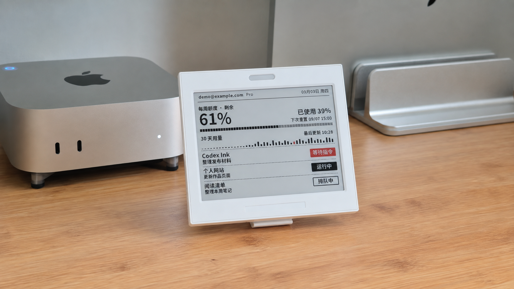
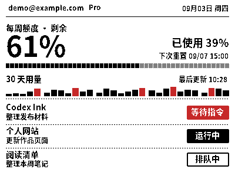
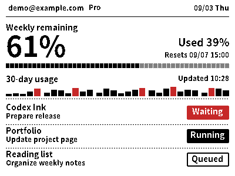

# Codex Ink

### Codex 墨水屏看板：查看使用额度与任务状态

把 Codex 使用额度和任务状态放到 Mac 旁的桌面墨水屏上。Codex Ink 读取现有 Codex 数据，通过蓝牙同步原生 400 × 300 画面。

[English](README.md) · [构建与安装](docs/installation.zh-CN.md) · [数据与隐私](docs/PRIVACY.md)

*上图基于真实桌面实拍优化构图并进行隐私处理，屏幕使用虚构演示数据。界面支持简体中文与 English。*

## 当前状态

当前应用版本为 **0.2.1 开发预览版**，已经在一台 Apple Silicon Mac 上验证源码构建及本地使用流程。独立安装包、Developer ID 签名、公证和第二台 Mac 验收尚未完成。

项目代码采用 [GPL-3.0-only](LICENSE)，字体等第三方资源保留各自许可，详见[第三方来源说明](THIRD_PARTY_NOTICES.md)。当前预览版需要从源码构建，暂不提供开箱即用的应用下载包。

## 屏幕显示什么

- **每周额度**：剩余比例、已使用比例和下次重置时间。
- **30 天用量**：根据 Codex 可读取历史生成的用量趋势。
- **最多三个任务**：项目名、任务标题和生命周期状态。
- **账号与套餐**：当前账号标识及数据源返回的套餐类型。

| 简体中文 | English |
| --- | --- |
|  |  |

*两张图均使用虚构演示数据，由原生渲染器按 400 × 300 分辨率生成。在概览 → 语言 / Language 切换语言，设置、菜单栏和墨水屏会使用保存的选择。*

## 使用方式

Mac 菜单栏应用负责预览、设备绑定、暂停/继续、登录启动和蓝牙发送。Codex hooks 在本地登记任务事件，Python worker 通过本机 app-server 读取账号、额度与任务元数据，再生成设备画面。

待刷新请求会保留，重复画面会跳过，暂时失败会退避重试。数据缺失或无效时保留旧画面，不用演示额度替代真实数据。

本项目监控的是 **Codex 活动**，不提供 ChatGPT 聊天功能，也不统计所有 GPT API 调用。

## 为什么做 Codex Ink

这是我第一次在 GitHub 开源自己的项目。它起于一个很小的个人需求，我也希望它能成为一个让更多人愿意动手尝试的起点。把它分享出来，是想让有相似需求的朋友少走一些弯路，少花一些重复摸索的时间和 token，把精力留给更有价值、也更想做的项目。

最初，我一直用 [CodexBar](https://github.com/steipete/CodexBar) 查看剩余额度。随着项目越来越复杂，我经常同时开着两三个 Codex 对话：有的正在运行，有的已经在等我给出下一步指令。对容易分心的我来说，等待时总会顺手去做点别的。我想要一个放在视线边缘的提示，让我不用反复切换窗口，也能知道什么时候该回来继续。

我看过红绿灯式的状态指示器，但还是希望多看到一点信息：还剩多少额度，哪个任务正在运行，哪个正在等我。于是，一块很早以前花了大约 30 元买来玩、后来一直闲置的墨水屏，终于找到了用途。

选择墨水屏也有一点意外的巧合。我考虑过其他外置显示方案，它们可能更流畅、显示效果也更好。但墨水屏刷新时的全屏闪烁，在这里恰好变成了一个优点：它本身就是醒目的视觉提醒，不用额外写一套提醒效果。这块屏幕原有的特性，刚好回应了我的需求。

这是第一个版本，还有很多不完善的地方。开始 vibe coding 之后，我越来越愿意接受一种节奏：**先做出来，再做好。** 先让一个想法进入日常使用，再慢慢弄清楚它真正需要什么。

欢迎提建议、分享你的使用方式，或者把它改成更适合自己的样子。我们与 Agent 交互的方式还在变化，希望这个小项目能成为其中一次有用的试错，也希望我们一起多做一些这样的探索。

## 使用条件

| 项目 | 当前条件 |
|---|---|
| macOS | 最低部署目标为 14；已验证 macOS 26.6.2、Apple Silicon |
| 编译环境 | Swift 6 工具链及 Apple 命令行工具 |
| Python | 外部 Python 与 Pillow；已验证 Python 3.9.6、Pillow 11.3.0 |
| Codex | 已登录，且支持本项目使用的 app-server 方法与 hooks |
| 墨水屏 | 符合[已记录 BLE 协议](docs/ble-protocol.md)的 400 × 300 黑白红设备 |

目前只验证过一台广播名为 `NRF_325608` 的设备，不能仅凭名称认定其他设备兼容。Intel Mac、其他屏幕型号及全部 macOS 14+ 版本均未验收。

## 开始使用

1. 按[安装指南](docs/installation.zh-CN.md)从源码构建。
2. 将 `Codex Ink.app` 放到稳定的 Applications 目录，再安装 hooks。
3. 保存 Codex/Python 路径，检查数据并生成真实预览。
4. 允许蓝牙访问，选择并验证设备。
5. 完成 hooks 安装与信任，再启用同步。

首次安装默认只预览。登录启动需要主动开启，并会记住当前配置目录，支持此前使用的自定义目录。

## 已验证与待验证

公开源码通过 **283 个 Python 测试用例**（其中原生驱动包含 **63 项 Swift 检查**）及 2 组 Swift 核心测试。Release 构建、应用打包与严格开发签名校验通过；在线构建结果见 [GitHub Actions](https://github.com/hubinvip-ai/codex-ink/actions)。本机还单独检查了配置恢复、hooks 迁移和自动刷新；这些与无硬件测试分别记录。

这不代表实屏外观、真实注销/登录、24 小时稳定性或其他 Mac 已验收。详见[发布说明](docs/releases/v0.4.2.md)。测试数字来自已记录的本机验证，不是在线 CI 状态。

## 致谢

特别感谢 [CodexBar](https://github.com/steipete/CodexBar) 的作者 **Peter Steinberger（steipete）及贡献者**，感谢他们在 macOS 上呈现 Codex、Claude Code 使用情况方面的开源工作。

感谢 **sakading** 的设备与通信方案，以及 **思源黑体、Pillow、FreeType** 的作者和贡献者。早期研究还参考了 **EPDTools、OpenEPaperLink、ATC_TLSR_Paper、walmart-esl-flipper** 和 **enzo-and-aqin 的三色墨水屏项目**。

[完整致谢](ACKNOWLEDGEMENTS.md)列出各项目链接和具体帮助，也感谢实际使用的 Codex、Python 与 Swift 工具链。[第三方说明](THIRD_PARTY_NOTICES.md)单独记录随包资源、外部依赖和研究参考的许可状态。

## 开发与反馈

- [参与开发](CONTRIBUTING.md)
- [数据与隐私](docs/PRIVACY.md)
- [详细操作说明](docs/companion-operator.md)
- [设备 UI 冻结规范](docs/eink-ui-spec.md)
- [历史 CLI 工具](docs/legacy-tools.md)

反馈请附 macOS/芯片、应用与 Codex 版本、设备信息和失败步骤。分享前隐藏账号、任务标题、本机路径及凭据。

Codex Ink 是独立项目，与 OpenAI 无隶属关系，也未获得其背书。

## 界面语言

在 **概览 → 语言 / Language** 选择简体中文或 English，设置、菜单栏、预览和墨水屏使用保存的语言。旧配置保持中文，项目、任务及设备名称保留原文。
